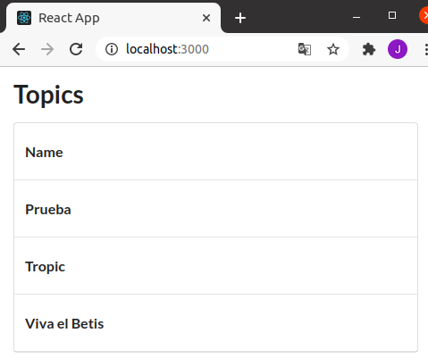

# Exercise 1
### Lo primero es crear la red
```bash
docker network create lemoncode-challenge
```
### Ahora hay que crear el contenedor de Mongo DB
Debe tener un volumen y conectarse a la red _lemoncode-challenge_
```bash
docker run --network lemoncode-challenge \
    --mount src=mongo-volumen,dst=/data/db \
    -d --name monguito mongo
```

### Seguimos con el contendor del backend
1. Generar el Dockerfile. Está en la carpeta [backend](../backend/backend/Dockerfile)
2. Desde dicha carpeta, generar la imagen del backend
```bash
docker build . -t lemoncode-challenge-backend --no-cache
```
3. Arrancar el contenedor. También debe estar en la red _lemoncode-challenge_.
```bash
docker run --network lemoncode-challenge \
    -e MONGO_URI=mongodb://monguito:27017 \
    -d --name backendcito -p 5000:5000 \
    lemoncode-challenge-backend
```

### Por último, el frontend
1. Generar el Dockerfile. Está en la carpeta [frontend](../frontend/Dockerfile)
2. Desde dicha carpeta, generar la imagen del frontend
```bash
docker build . -t lemoncode-challenge-frontend --no-cache
```
3. Arrancar el contenedor.
```bash
docker run -e REACT_APP_API_URL=http://localhost:5000/api/topics \
    -d --name frontendcito -p 3000:3000 \
    lemoncode-challenge-frontend
```

### Añadir topics a la base de datos
Tenemos nuestra aplicación ejecutándose en tres contenedores, pero la base de datos está vacía. Vamos a añadir unos pocos datos para comprobar que la aplicación funciona correctamente.
1. Abrir el CLI de mongo
```bash
docker exec -it monguito mongo
```
2. Una vez abierto el CLI de mongo, ejecutar los siguientes comandos
```bash
use TopicstoreDb
db.Topics.insert({
    Name: 'Prueba'
})
db.Topics.insert({
    Name: 'Tropic'
})
db.Topics.insert({
    Name: 'Viva el Betis'
})
exit
```
3. Ir a la url localhost:3000 para verificar

