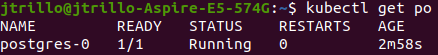
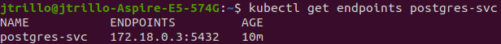
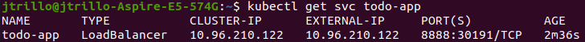
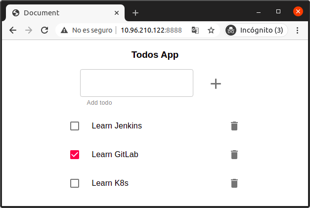

# Exercise 1 - Monolith
### Create a data persistence layer
1. Create a directory for the required PersistentVolume inside minikube node
```bash
minikube ssh # This command will open node's shell
sudo mkdir /mnt/monolith
exit
```
2. Create a Cluster IP service
```yaml
# postgres-svc.yaml
apiVersion: v1
kind: Service
metadata:
  labels:
    app: postgres-svc
  name: postgres-svc
spec:
  selector:
    app: postgres
  type: ClusterIP
  ports:
    - port: 5432
      protocol: TCP
      targetPort: 5432
```

```bash
kubectl create -f postgres-svc.yaml
```

3. Create the StatefulSet
```yaml
# sts.yaml
apiVersion: apps/v1
kind: StatefulSet
metadata:
  name: postgres
spec:
  selector:
    matchLabels:
      app: postgres
  serviceName: postgres-svc
  replicas: 1
  template:
    metadata:
      labels:
        app: postgres
    spec:
      containers:
      - name: postgres
        image: postgres:10.4
        volumeMounts:
        - name: postgres-disk
          mountPath: /var/lib/postgresql/data
  volumeClaimTemplates:
  - metadata:
      name: postgres-disk
    spec:
      accessModes: ["ReadWriteOnce"]
      resources:
        requests:
          storage: 10Mi
```

```bash
kubectl create -f sts.yaml
```

4. Populate database
```bash
kubectl get po # Get postgres pod name, in this case 'postgres-0'
kubectl exec postgres-0 -it bash
psql -U postgres
```



Then, at postgres shell, paste this [content](https://github.com/Lemoncode/bootcamp-devops-lemoncode/blob/master/02-orquestacion/exercises/01-monolith/todo-app/todos_db.sql) and press enter.

### Create 'todo-app'
1. Generate image from this [Dockerfile](https://github.com/Lemoncode/bootcamp-devops-lemoncode/blob/master/02-orquestacion/exercises/01-monolith/todo-app/Dockerfile)
```bash
docker build . -t jtrillo/monolith --no-cache
```

2. Push image to Docker Hub
```bash
# First execute 'docker login'
docker image push jtrillo/monolith
```
3. Get postgres service endpoint
```bash
kubectl get endpoints postgres-svc
# We need endpoint IP to feed environment variable 'DB_HOST' at the next step. In this case it's 172.18.0.3. 
```



4. Create ConfigMap
```yaml
# cm-monolith.yaml
apiVersion: v1
kind: ConfigMap
metadata:
  name: cm-monolith
data:
  DB_HOST: "172.18.0.3"
  DB_USER: postgres
  DB_PASSWORD: postgres
  DB_PORT: "5432"
  DB_NAME: todos_db
  DB_VERSION: "10.4"
```

```bash
kubectl create -f cm-monolith.yaml
```

5. Create _todo-app_ deployment
```yaml
# deployment.yaml
apiVersion: apps/v1
kind: Deployment
metadata:
  labels:
    app: todo-app
  name: todo-app
spec:
  replicas: 1
  selector:
    matchLabels:
      app: todo-app
  strategy: {}
  template:
    metadata:
      labels:
        app: todo-app
    spec:
      containers:
      - envFrom:
        - configMapRef:
            name: cm-monolith
        image: jtrillo/monolith
        name: monolith
        resources: {}
status: {}
```

```bash
kubectl create -f deployment.yaml
```

### Accessing 'todo-app' from outside the cluster
1. Run **minikube**'s tunnel in a separate terminal
```bash
minikube tunnel
```
2. Create a LoadBalancer service
```bash
kubectl expose deploy todo-app --type=LoadBalancer \
--port=8888 --target-port=3000
```

3. Get service external IP
```bash
kubectl get svc todo-app
# We are looking for service 'todo-app' IP. In this case it's 10.96.210.122
```



4. Check in the browser

