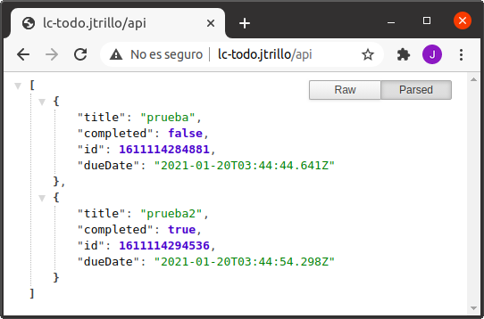

# Exercise 2 - Distributed
### Create 'todo-front'
1. Generate image from this [Dockerfile](https://github.com/Lemoncode/bootcamp-devops-lemoncode/blob/master/02-orquestacion/exercises/02-distributed/todo-front/Dockerfile)
```bash
docker build . -t jtrillo/todo-front --no-cache
```
2. Push image to Docker Hub
```bash
# First execute 'docker login'
docker image push jtrillo/todo-front
```
3. Create _todo-front_ deployment
```bash
kubectl create deploy todo-front --image jtrillo/todo-front
```
4. Create a Cluster IP service to expose _todo-front_ within the cluster
```bash
kubectl expose deploy todo-front --port=80 --target-port=80
```

### Create 'todo-api'
1. Generate image from this [Dockerfile](https://github.com/Lemoncode/bootcamp-devops-lemoncode/blob/master/02-orquestacion/exercises/02-distributed/todo-api/Dockerfile)
```bash
docker build . -t jtrillo/todo-api --no-cache
```
2. Push image to Docker Hub
```bash
# First execute 'docker login'
docker image push jtrillo/todo-api
```
3. Create _todo-api_ deployment
```bash
kubectl create deploy todo-api --image jtrillo/todo-api
```
4. Create a Cluster IP service to expose _todo-api_ within the cluster
```bash
kubectl expose deploy todo-api --port=80 --target-port=3000
```

### Create ingress resources to expose cluster services
0. Enable minikube NGINX Ingress controller
```bash
minikube addons enable ingress
```

1. Expose _todo-front_ through route lc-todo.jtrillo/
```yaml
# ingress-front.yaml
apiVersion: networking.k8s.io/v1
kind: Ingress
metadata:
  annotations:
    kubernetes.io/ingress.class: nginx
  name: ingress-front
spec:
  rules:
  - host: "lc-todo.jtrillo"
    http:
      paths:
      - path: /
        pathType: Prefix
        backend:
          service:
            name: todo-front
            port:
              number: 80
```

```bash
kubectl create -f ingress-front.yaml
```

2. Expose _todo-api_ through route lc-todo.jtrillo/api
```yaml
# ingress-api.yaml
apiVersion: networking.k8s.io/v1
kind: Ingress
metadata:
  annotations:
    kubernetes.io/ingress.class: nginx
  name: ingress-api
spec:
  rules:
  - host: "lc-todo.jtrillo"
    http:
      paths:
      - path: /api
        pathType: Prefix
        backend:
          service:
            name: todo-api
            port:
              number: 80
```

```bash
kubectl create -f ingress-api.yaml
```

3. Edit hosts file (/etc/hosts or C:\windows\system32\drivers\etc\hosts) to include ingress IP


As we can see in the picture, my ingress IP is 172.17.0.2.

```bash
# /etc/hosts, add this line
172.17.0.2  lc-todo.jtrillo
```

4. Check in the browser



