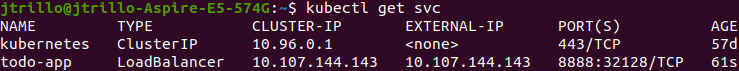
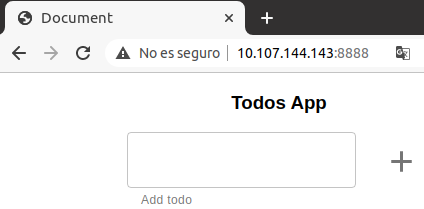

# Exercise 0 - Monolith in memory
### Create 'todo-app'
1. Generate image from this [Dockerfile](https://github.com/Lemoncode/bootcamp-devops-lemoncode/blob/master/02-orquestacion/exercises/00-monolith-in-mem/todo-app/Dockerfile)
```bash
docker build . -t jtrillo/monolith-in-mem --no-cache
```
2. Push image to Docker Hub
```bash
# First execute 'docker login'
docker image push jtrillo/monolith-in-mem
```
3. Create _todo-app_ deployment
```bash
kubectl create deploy todo-app --image jtrillo/monolith-in-mem
```

### Accessing 'todo-app' from outside the cluster
1. Run **minikube**'s tunnel in a separate terminal
```bash
minikube tunnel
```
2. Create a LoadBalancer service
```bash
kubectl expose deploy todo-app --type=LoadBalancer \
--port=8888 --target-port=3000
```

3. Get service external IP
```bash
kubectl get svc
# We are looking for service 'todo-app' IP. In my case it's 10.107.144.143
```



4. Check in the browser

