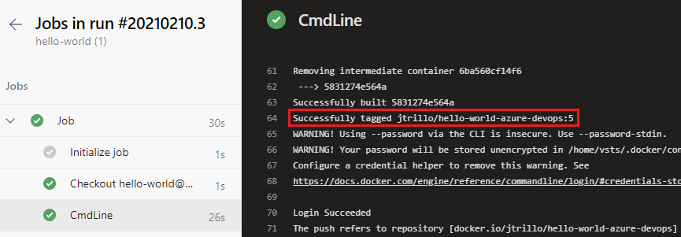
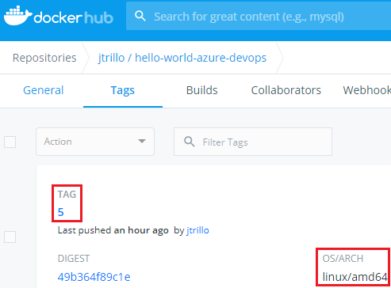
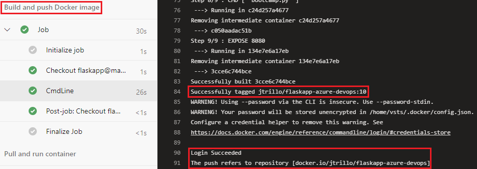
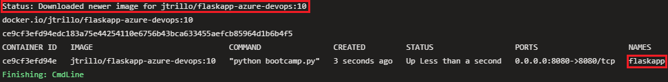
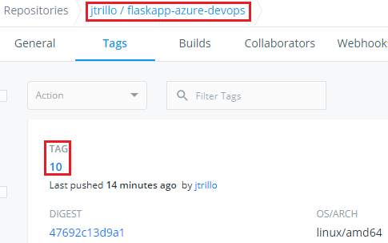

# Azure Devops Exercises

### Create a pipeline that generates a Docker image and that pushes it to Docker Hub
[Starting point](https://github.com/Lemoncode/bootcamp-devops-lemoncode/tree/master/03-cd/03-azure-devops/hello-world). I have an Azure Repository with all this code. Pipeline to generate a Docker file and push it to Docker Hub is here, down below. As you can see, I use 2 defined variables: `dockerId` and `dockerPassword`. These can be added on the pipeline YAML editor, clicking button *Variables* (top right corner). `Build.BuildId` is a predefined variable.
```yml
trigger:
- main

pool:
  vmImage: 'ubuntu-latest'

steps:
- script: |
    docker build -f Dockerfile -t $dockerImage .
    docker login -u $(dockerId) -p $(dockerPassword)
    docker push $dockerImage
  env:
    dockerImage: $(dockerId)/hello-world-azure-devops:$(Build.BuildId)
```

Pipeline output displays that image build has been successful and image has been tagged with build number (in this case 5).



Checking on Docker Hub we can verify that image has been pulled with tag *5* and OS linux (we used a ubuntu machine on the pipeline).



### Flaskapp on Azure Devops
1. Create a new project
2. Initialize repository
3. Upload code to repository this [code](https://github.com/Lemoncode/bootcamp-devops-lemoncode/tree/master/03-cd/02-gitlab/flaskapp)
4. Create a new Azure Pipeline that 
   1. Builds the image and push it to Docker Hub
   2. Pulls the image from Docker Hub and runs a container
```yml
trigger:
- main

pool:
  vmImage: 'ubuntu-latest'

variables:
  dockerImage: '$(dockerId)/flaskapp-azure-devops:$(Build.BuildId)'

stages:
- stage: BuildAndPush
  displayName: Build and push Docker image
  jobs:
    - job:
      steps:
      - script: |
          docker build -f Dockerfile -t $(dockerImage) .
          docker login -u $(dockerId) -p $(dockerPassword)
          docker push $(dockerImage)

- stage: RunContainer
  displayName: Pull and run container
  jobs:
    - job:
      steps:
      - script: |
          docker pull $(dockerImage)
          docker run --name flaskapp -d -p 8080:8080 $(dockerImage)
          docker ps
```

5. Run the pipeline

As we can see down below, build id is _10_, so image tag is also _10_.





Checking on Docker Hub we can verify that image has been pulled with tag _10_.

