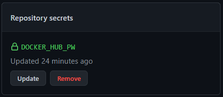
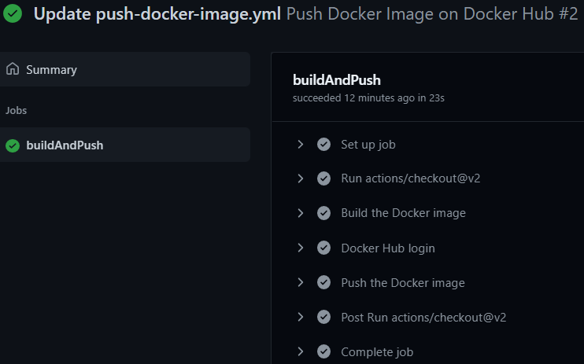
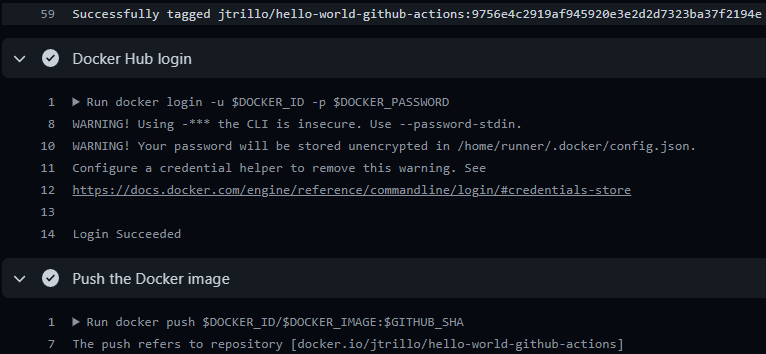

# GitHub Actions exercises

1. Create a new repository
2. Push this [code](https://github.com/Lemoncode/bootcamp-devops-lemoncode/tree/master/03-cd/03-azure-devops/hello-world)
3. Create a new workflow to build and push a Docker image on Docker Hub
```yml
name: Push Docker Image on Docker Hub

on:
  push:
    branches: [ main ]

env:
  DOCKER_ID: jtrillo
  DOCKER_IMAGE: hello-world-github-actions

jobs:
  buildAndPush:
    runs-on: ubuntu-latest
    steps:
    - uses: actions/checkout@v2
    - name: Build the Docker image
      run: docker build -f Dockerfile -t $DOCKER_ID/$DOCKER_IMAGE:$GITHUB_SHA .
    - name: Docker Hub login
      env:
        DOCKER_PASSWORD: ${{ secrets.DOCKER_HUB_PW }}
      run: docker login -u $DOCKER_ID -p $DOCKER_PASSWORD
    - name: Push the Docker image
      run: docker push $DOCKER_ID/$DOCKER_IMAGE:$GITHUB_SHA
```
4. Create a new repository secret (Repo settings > Secrets > New repository secret)



5. Commit the workflow file `push-docker-image.yml`. The execution will be triggered






### Links
[Repository where I made the exercise](https://github.com/JTrillo/github-actions-exercise)