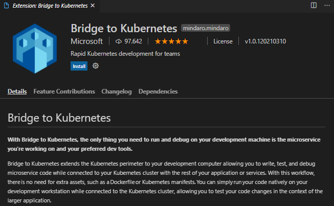

# AKS (Azure Kubernetes Service)

### Azure CLI Installation
In order to work with AKS it is mandatory to install Azure CLI. There are several ways to install Azure CLI in your machine, but the most useful for me are the next ones ([more info](https://docs.microsoft.com/en-us/cli/azure/install-azure-cli)).

#### On Windows
```pw
Invoke-WebRequest -Uri https://aka.ms/installazurecliwindows -OutFile .\AzureCLI.msi; Start-Process msiexec.exe -Wait -ArgumentList '/I AzureCLI.msi /quiet'; rm .\AzureCLI.msi
```

#### On Ubuntu
WARNING: Ubuntu 20.04 (Focal Fossa) and 20.10 (Groovy Gorilla) include an `azure-cli` package with version `2.0.81` provided by the `universe` repository. This package is outdated and not recommended. If this package is installed, remove the package before continuing by running the command `sudo apt remove azure-cli -y && sudo apt autoremove -y`.
```bash
curl -sL https://aka.ms/InstallAzureCLIDeb | sudo bash
```

#### Using a Docker container
```bash
docker run --it --rm microsoft/azure-cli sh
```

### Working with AKS
First of all you have to log in Azure.
```bash
az login
```

Before creating a cluster it is necessary to create a resource group.
```bash
# $LOCATION is the region where we cant to locate our resource group
# 'northeurope' is one of them
az group create -n $GROUP_NAME -l $LOCATION
```

To create a Kubernetes cluster execute next command. By default 3 nodes will be generated but it is possible to change it using option `--node-count`. All possible options are detailed [here](https://docs.microsoft.com/en-us/cli/azure/aks?view=azure-cli-latest#az_aks_create). Only options `-g/--resource-group` and `-n/--name` are mandatory.

```bash
az aks create -g $GROUP_NAME -n $CLUSTER_NAME \
--node-count 1 --generate-ssh-keys
```

It is possible to install `kubectl` using Azure CLI.
```bash
az aks install-cli
```

Azure CLI has a command to configure our Azure Kubernetes cluster on kubectl. It will make our AKS as current context in `$HOME/.kube/config`.
```bash
az aks get-credentials -g $GROUP_NAME -n $CLUSTER_NAME
```

Check it using `kubectl get nodes`.

To scale the cluster use the command `az aks scale`.
```bash
az aks scale -g $GROUP_NAME -n $CLUSTER_NAME --node-count 3
```

Check it again with `kubectl get nodes`.

If we delete the resource group, the cluster will be eliminated too.
```bash
az group delete -n $GROUP_NAME --yes --no-wait
```

### Bridge to Kubernetes
Bridge to Kubernetes is a VS Code extension that allows you to redirect your AKS traffic to your development environment. It is useful to debug one microservice while the others keep cluster state.



### Cluster Autoscaler
The cluster autoscaler component can watch for pods in the cluster that can't be scheduled because of resource constraints. When issues are detected, the number of nodes in a node pool is increased to meet the application demand (more information [here](https://docs.microsoft.com/en-us/azure/aks/cluster-autoscaler#using-the-autoscaler-profile)).

#### How to enable it?
When creating or updating a cluster by including `--enable-cluster-autoscaler` parameter. It also demands the minimum (`--min-count`) and maximum (`--max-count`) of nodes. 
```bash
az aks create -g $GROUP_NAME -n $CLUSTER_NAME \
--enable-cluster-autoscaler \ 
--min-count -1 --max-count 3
```

### Virtual Kubelets (virtual nodes)
It is a way to set up a cluster that creates virtual nodes when it is necessary to deploy more pods (and all existing nodes are already occupied). On Azure, those virtual nodes are created within seconds by means of Azure Container Instances (ACI). In order to communicate AKS cluster with those virtual nodes, it is neccesary to made some preparations, which are noted on [virtual-kubelet.sh](virtual-kubelet.sh).

In addition, deployment YAML file must include section `tolerations`. Check an example down below:

```yaml
apiVersion: apps/v1
kind: Deployment
metadata:
  name: nginx-deployment
  labels:
    app: nginx
spec:
  replicas: 3
  selector:
    matchLabels:
      app: nginx
  template:
    metadata:
      labels:
        app: nginx
    spec:
      containers:
        - name: nginx
          image: nginx
          ports:
            - containerPort: 80
          resources:
            requests:
              memory: 1.5G
              cpu: 1
      tolerations:
        - key: virtual-kubelet.io/provider
          value: azure
          effect: NoSchedule
```

### KEDA & Azure Active Directory
Check [here](https://github.com/Lemoncode/bootcamp-devops-lemoncode/tree/master/04-cloud/00-aks).